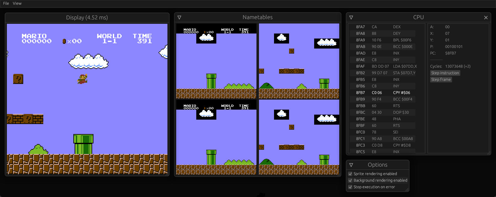

# NESsu - NES Emulator

Nessu is a NES emulator written in the Rust programming language.
This is a personal project that I started for learning how emulators work.

## Usage
* Start the emulator by running `cargo run -p nessu-app`.
* Drag & drop a NES rom onto the emulator

## Keymap

### Controllers
* Arrow keys: **Up/Down/Left/Right**
* Enter: **Start**
* S: **Select**
* A: **A**
* B: **B**

### Miscellaneous
* Space: stop/resume execution

## Supported mappers
* [NROM](https://www.nesdev.org/wiki/NROM)
* [UxROM](https://www.nesdev.org/wiki/UxROM)
* [MMC1](https://www.nesdev.org/wiki/MMC1)
* [MMC3](https://www.nesdev.org/wiki/MMC3)
* [MMC4](https://www.nesdev.org/wiki/MMC4)

## Some known issues and missing features

* Audio (APU) has not yet been implemented.
* Some games do not work properly, possibly due to timing issues or bugs in the mappers. 
For example, Final Fantasy gets stuck when a fight starts and Mario 3 has some visual bugs.
* Various timing test roms do not yet pass.